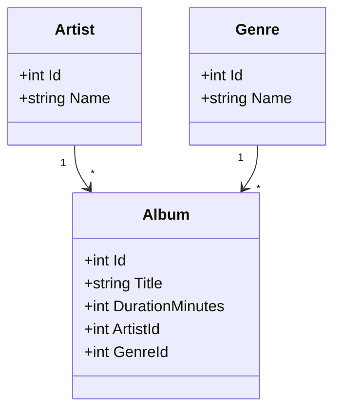
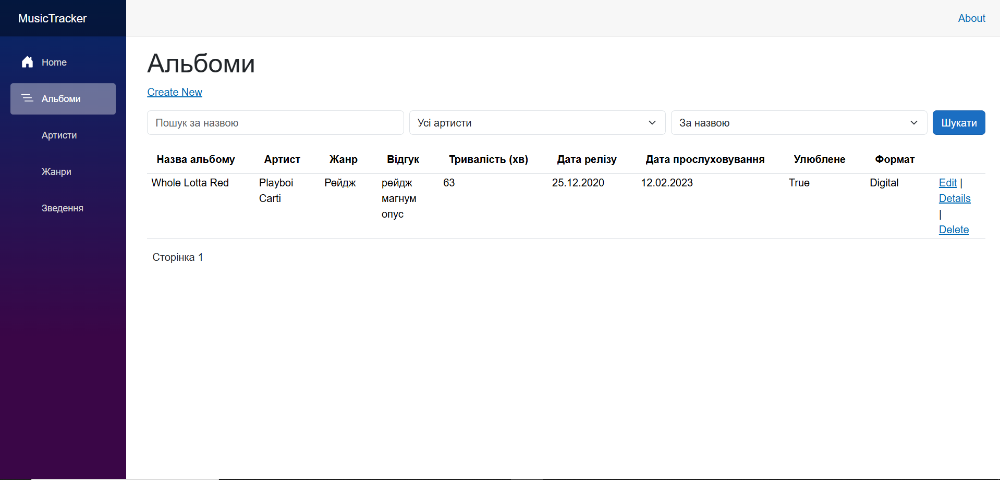
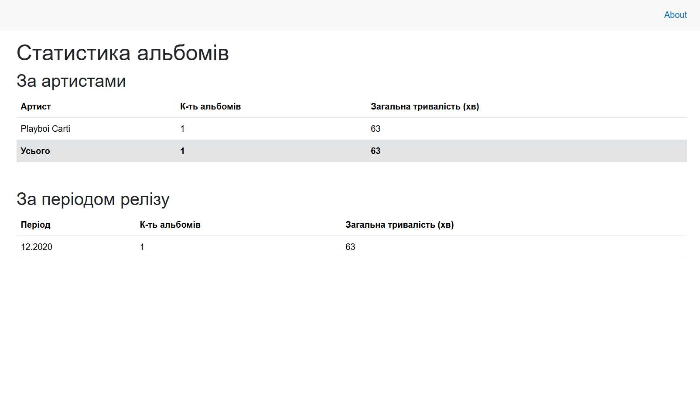
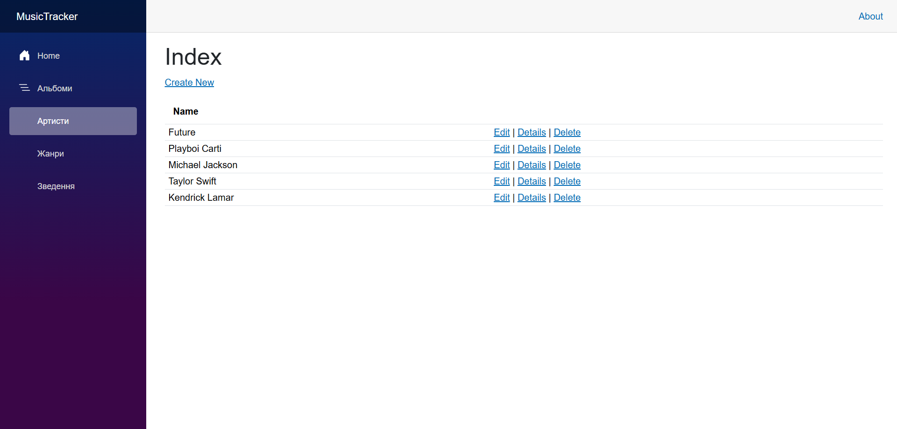

# MusicTracker
Тема №39 «Облік музичної колекції»
Вебзастосунок для обліку улюблених музичних альбомів, виконавців та статистики прослуховувань

# Основний тип даних (Album)
Запис про музичний альбом містить такі властивості:
- Id (ідентифікатор)
- Title (назва альбому)
- Review (особистий відгук)
- DurationMinutes (загальна тривалість у хвилинах)
- ReleaseDate (дата виходу)
- ListenedOn (дата прослуховування)
- IsFavorite (чи додано до улюблених)
- Format (формат носія: Digital, CD, Vinyl, Cassette)

# Особливість проєкту
Завантаження та показ зображень для записів. До кожного альбому можна буде завантажити його обкладинку (файл зображення), яка зберігатиметься на сервері та відображатиметься в каталозі та на сторінці деталей альбому.

## Діаграма класів (ЛР 7)

## Скріншоти (ЛР 10)

